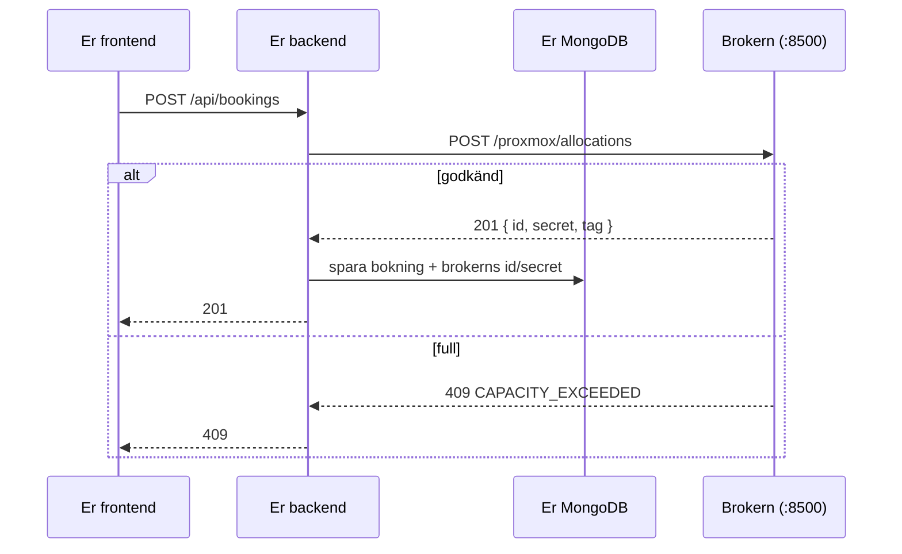

**Gäller bara er som valt resource-booking.** Texteditor-grupper kan hoppa över den här sidan.

Brokern är **en förutsättning för projektet**, inte ett krav, och den ingår inte i [Baseline](/projektet/baseline/). Er backend **ska** använda den för resurser och bokningar.

## Vad är brokern?

Kursen har tre isolerade testsystem: **Proxmox** (virtuella maskiner), **MAAS** (fysiska maskiner) och **OpenStack** (molnkvot). Ni får inte tillgång till deras API:er eller webbgränssnitt. I stället pratar ni med en **broker**, en mellanhand som kör på servern `dv1677-anton`, och som

- visar vad som finns och hur mycket som är ledigt,
- tar emot bokningar och **godkänner eller nekar** dem utifrån verklig kapacitet,
- ser till att alla grupper delar på samma infrastruktur utan att dubbelboka.

Poängen är att *er databas inte är sanningen.* Den lagrar vad som *ska* gälla, medan systemet bakom vet vad som *är* sant. Det är ett riktigt integrationsproblem.



**Frontenden pratar aldrig med brokern.** Bara er backend gör det, med en hemlig token.

## Vad en bokning betyder

Brokern för en bokföring över vem som har reserverat vad och när. **Ni får ingen riktig maskin** som ni loggar in på. Det som sker i era bokningar är att brokern godkänner eller nekar ett tidsfönster. Det är precis det som er bokningslogik ska hantera.

| Typ | Vad en resurs är | Hur ni bokar | Vad som händer |
|-----|------------------|--------------|----------------|
| **Proxmox** | En nod med kapacitet (vCPU, RAM, disk). **Delbar** — flera bokningar rymms samtidigt så länge summan ryms | `want: { vcpus, ramMb, diskGb }` | Brokern reserverar kapaciteten. Ingen VM skapas åt er |
| **MAAS** | En hel maskin. **Odelbar** — en bokning åt gången | `systemId` | Brokern markerar maskinen som er när tidsfönstret börjar |
| **OpenStack** | Ett projekts kvot (vCPU, RAM). En enda delbar "resurs", utan disk | `want: { vcpus, ramMb }` | Brokern reserverar kvoten. Går inte att ta i anspråk på riktigt |

### Vilka resurser ska ni boka?

**Samtliga** — Proxmox, MAAS och OpenStack ska kunna bokas i er app. Men resurserna är **få och delas av alla grupper** (MAAS har fem maskiner, Proxmox och OpenStack en nod respektive ett projekt). Därför:

- **Låt inte bokningar ligga för länge.** Boka kort, och avboka era testbokningar direkt. Annars står andra grupper utan.
- En bokning kan nekas (`ALREADY_BOOKED`, `CAPACITY_EXCEEDED`) för att en annan grupp har resursen, inte för att er egen logik är fel.

Typerna skiljer sig åt: MAAS-maskiner är **odelbara** (bokad eller ledig). Proxmox och OpenStack är **delbara**, där bara summan av kraven avgör och där brokern fattar beslutet.

Det är samma tänk som i bokningslogiken: en konferenssal är *bokad eller ledig*, medan en nod med 16 vCPU rymmer fyra bokningar à 4 och nekar den femte. Skillnaden är bara att *brokern* nu fattar beslutet.

## Kom igång

1. **Token.** Varje grupp får en egen token som läraren lämnar ut privat. Den är hemlig och behandlas som `MONGODB_URI`: bara som secret, aldrig i repot, aldrig i frontenden och aldrig i en skärmdump.
2. **Adress.** Brokern nås på `http://194.47.155.214:8500` — från er VPS (och från skolans nät).
3. **Backend.** Anropen görs från er backend. Brokern har ingen CORS, så en frontend på GitHub Pages kan inte anropa den, och token får inte ligga i frontenden.

Lägg till i `.env.example`, i deploy-workflowet och i `docker-compose.yml`:

| Variabel | Vad |
|----------|-----|
| `BROKER_API_URL` | Brokerns adress, utan avslutande `/` |
| `BROKER_GROUP_TOKEN` | Er grupps token (GitHub-secret). **Aldrig `VITE_`-prefix** |

**Testa att det fungerar** (från er VPS eller skolans nät). Svaret ska vara er grupp och tagg:

```bash
curl -s -H "X-Booker-Group: $BROKER_GROUP_TOKEN" $BROKER_API_URL/whoami
# { "label": "grupp-5", "tag": "g05" }
```

## Vad skickas var?

Tre saker skickas till brokern, och var de hör hemma är det enda ni behöver komma ihåg:

| Vad | Hur det skickas | När |
|-----|-----------------|-----|
| **Token** (er grupp) | header `X-Booker-Group` | **Alltid**, i varje anrop |
| **id** (en bokning) | i adressen: `/allocations/<id>/…` | Förläng och avboka |
| **secret** (en bokning) | header `X-Booker-Allocation-Secret` | Förläng och avboka |

Allt som beskriver *vad ni vill boka* (`want`, `user`, `endsAt` …) skickas som JSON i **body**.

| Åtgärd | Anrop | Token | id | secret | Body |
|--------|-------|:-----:|:--:|:------:|------|
| Vem är vi | `GET /whoami` | ja | | | |
| Se resurser | `GET /<typ>/inventory` | ja | | | |
| **Boka** | `POST /<typ>/allocations` | ja | | | vad ni vill ha |
| Se era bokningar | `GET /<typ>/allocations` | ja | | | |
| Ändra sluttid | `POST /<typ>/allocations/<id>/extend` | ja | ja | ja | `endsAt` |
| **Avboka** | `POST /<typ>/allocations/<id>/withdraw` | ja | ja | ja | |

`<typ>` är `proxmox`, `maas` eller `openstack`.

## Så använder ni API:t

Alla exempel är Node.js med inbyggda `fetch`, och de har provkörts mot brokern. Börja med de här raderna, som gäller för alla exempel nedan:

```js
const BASE = process.env.BROKER_API_URL
const headers = {
  'X-Booker-Group': process.env.BROKER_GROUP_TOKEN,
  'Content-Type': 'application/json',
}
```

### Vem är vi?

```js
const res = await fetch(`${BASE}/whoami`, { headers })
console.log(await res.json())   // { label: 'grupp-5', tag: 'g05' }
```

### Se vad som finns

```js
const res = await fetch(`${BASE}/proxmox/inventory`, { headers })
const { nodes } = await res.json()
console.log(nodes.map(n => n.name))   // ['dv1677-fakeprox']
```

För MAAS får ni `{ machines }` i stället för `{ nodes }`, och för OpenStack `{ projects }`. Se [Referens](#referens) nedan.

### Boka

Vad ni skickar i body beror på typen. Det enda ni alltid måste ange är `user` och `endsAt`.

```js
// Proxmox: berätta vad ni behöver, inte vilken maskin
const res = await fetch(`${BASE}/proxmox/allocations`, {
  method: 'POST',
  headers,
  body: JSON.stringify({
    want: { vcpus: 1, ramMb: 1024, diskGb: 10 },
    user: 'u123',
    endsAt: '2026-10-20T18:00:00Z',
  }),
})
const { allocation } = await res.json()
console.log(allocation.id, allocation.secret)   // spara båda direkt!
```

För de andra typerna ändrar ni bara body:

```js
{ systemId: 'xk6y7d', user: 'u123', endsAt: '…' }                  // MAAS: peka ut maskinen
{ want: { vcpus: 1, ramMb: 1024 }, user: 'u123', endsAt: '…' }     // OpenStack: som Proxmox, utan diskGb
```

| Fält | Krav | Förklaring |
|------|------|------------|
| `endsAt` | ja | ISO 8601 |
| `user` | ja | Fri text. Använd ert interna användar-id, **inte e-post** (syns för andra i inventory) |
| `startsAt` | nej | Standard: nu |
| `idempotencyKey` | nej | Samma nyckel en gång till ger tillbaka er ursprungliga bokning i stället för en ny. Bra vid retry, använd ert bokning-`_id` |

### id och secret

Svaret på en bokning innehåller två värden:

- **`id`** är bokningens identitet, som ett ordernummer.
- **`secret`** är bokningens eget lösenord. Det krävs för att **förlänga** och **avboka** just den bokningen.

Token säger att *ni* är ni. Secret säger att det är *ni som äger just den här bokningen*.

**Båda visas bara i svaret på själva bokningen.** Tappar ni dem går bokningen inte att avboka eller förlänga. Spara dem direkt i er egen databas, och lämna **aldrig ut `secret`** till frontenden:

```js
await db.collection('bookings').updateOne(
  { _id: bookingId },
  { $set: { broker: { allocationId: allocation.id, secret: allocation.secret } } },
)
```

### Se era bokningar

```js
const res = await fetch(`${BASE}/proxmox/allocations`, { headers })
const { allocations } = await res.json()   // era aktiva bokningar, utan id och secret
```

### Ändra sluttid

Här behövs `id` i adressen och `secret` som header:

```js
const res = await fetch(`${BASE}/proxmox/allocations/${id}/extend`, {
  method: 'POST',
  headers: { ...headers, 'X-Booker-Allocation-Secret': secret },
  body: JSON.stringify({ endsAt: '2026-10-20T19:00:00Z' }),
})
```

Kortar ni tiden går det alltid. **Förlänger** ni görs samma kontroll som vid en ny bokning, så den kan nekas.

### Avboka

```js
const res = await fetch(`${BASE}/proxmox/allocations/${id}/withdraw`, {
  method: 'POST',
  headers: { ...headers, 'X-Booker-Allocation-Secret': secret },
})
console.log((await res.json()).allocation.status)   // 'released'
```

Det är säkert att anropa igen med samma `id` och `secret` efter en timeout. Ni får samma svar.

### När brokern säger nej

Ett `409` betyder att bokningen nekades. Det är **inte ett fel i er kod**, utan ett svar att visa för användaren:

```js
if (res.status === 409) {
  const { code } = await res.json()   // 'CAPACITY_EXCEEDED' (Proxmox/OpenStack) eller 'ALREADY_BOOKED' (MAAS)
}
```

Resurserna delas av alla grupper, så en nekad bokning kan bero på att en annan grupp har resursen. Hela listan över felkoder finns i [Referens](#referens).

## Referens

<details>
<summary>Vad inventory svarar med (olika form per typ)</summary>

**Proxmox** — en post per nod. `used` är verklig användning just nu:

```json
{ "nodes": [{
  "id": "dv1677-fakeprox", "name": "dv1677-fakeprox",
  "capacity": { "vcpus": 16, "ramMb": 65536, "diskGb": 500 },
  "used": { "vcpus": 4, "ramMb": 8192, "diskGb": 80 },
  "vms": [ … ]
}] }
```

**MAAS** — en post per maskin. `owner` är `null` om ingen har bokat den:

```json
{ "machines": [{ "id": "xk6y7d", "name": "node-3",
  "capacity": { "vcpus": 8, "ramMb": 16384 }, "owner": "bob", "source": "booker" }] }
```

**OpenStack** har en annan form — ett projekts kvot, inte enskilda maskiner:

```json
{ "projects": [{ "id": "…", "name": "…", "capacity": { "vcpus": 20, "ramMb": 51200 },
  "used": { "vcpus": 0, "ramMb": 0 }, "servers": [ … ] }] }
```

⚠️ `used` för OpenStack visar alltid 0, en känd begränsning. Kontrollera själva formen med `curl` innan ni skriver koden.

Fältet `owner` är det `user` som någon bokade med. Skicka därför aldrig e-postadresser som `user` (se [Boka](#boka)).


</details>

<details>
<summary>capacity och availability</summary>

**`GET /proxmox/capacity` — hur stort är systemet?**

Bara Proxmox (och OpenStack). Systemets *totala* kapacitet, utan bokningar avräknade — till för att planera framåt.

```bash
curl -s -H "X-Booker-Group: $TOKEN" $URL/proxmox/capacity
# → { "vcpus": 16, "ramMb": 32090.66, "diskGb": 125.79 }
```

För MAAS finns inget sådant (en maskin är odelbar) och `GET /maas/capacity` svarar alltid `404 NOT_APPLICABLE`. Använd `/maas/availability`.

Svaret har `ETag`. Skicka `If-None-Match: "<etag>"` så får ni `304 Not Modified` så länge inget ändrats. Det kostar ingenting att fråga ofta.

**`GET /<provider>/availability` — vad är ledigt just nu?**

```bash
curl -s -H "X-Booker-Group: $TOKEN" $URL/proxmox/availability
# → { "vcpus": 14, "ramMb": 27994.66, "diskGb": 105.79 }

curl -s -H "X-Booker-Group: $TOKEN" $URL/maas/availability
# → { "machines": [{ "id": "xk6y7d", "name": "simple-buck", "capacity": { "vcpus": 2, "ramMb": 2048 } }] }
```

Det är läget **just nu**, inte för framtida tider. Det är en förhandsvisning, inte ett löfte: `POST` kan fortfarande nekas direkt efteråt.


</details>

<details>
<summary>Felkoder</summary>

Brokern svarar `{ "error": "...", "code": "..." }`.

| Kod | Status | Betyder | Vad ni gör |
|-----|--------|---------|------------|
| `GROUP_HEADER_MISSING` | 401 | Ingen `X-Booker-Group` | Bugg hos er. Kontrollera `BROKER_GROUP_TOKEN` |
| `GROUP_REJECTED` | 403 | Okänd eller spärrad token | Be läraren kontrollera/byta token |
| `USER_MISSING` | 400 | `user` saknas vid bokning | Skicka `user` |
| `TIME_WINDOW_MISSING` | 400 | `endsAt` saknas | Skicka `endsAt` |
| `BAD_REQUEST` | 400 | Felaktig body, eller `want`/`systemId` saknas/ogiltigt | Kontrollera body |
| `NO_SUCH_MACHINE` | 404 | MAAS: okänt `systemId` | Er resurslista är inaktuell → synka igen |
| `ALREADY_BOOKED` | 409 | MAAS: maskinen är bokad i fönstret | Visa för användaren. Inte ett fel i koden |
| `CAPACITY_EXCEEDED` | 409 | Proxmox/OpenStack: ryms inte i fönstret | Visa för användaren. Inte ett fel i koden |
| `ALLOCATION_SECRET_MISSING` | 401 | Ingen `X-Booker-Allocation-Secret` | Skicka secret |
| `ALLOCATION_REJECTED` | 403 | Okänd bokning, fel secret, eller inte er grupps | Ni har tappat eller skrivit över secret |
| `NOT_APPLICABLE` | 404 | `GET /maas/capacity` | Använd `/maas/availability` |
| `BACKEND_UNAVAILABLE` | 502 | Brokern kunde inte läsa live-läget | Försök igen senare |

Egna koder i er klient: `UNREACHABLE` (ingen kontakt) och `NOT_CONFIGURED` (saknad konfiguration) — svara med `503` till användaren.


</details>

## Regler när ni använder brokern

- **Kapaciteten delas av alla grupper.** Boka litet (1 vCPU, ~1 GB) och kort (högst en timme), och **avboka era testbokningar** direkt. Bokar ni upp noden får andra grupper `409`.
- Boka aldrig MAAS-maskiner "för säkerhets skull".
- Token i secrets, aldrig i repot, aldrig i frontenden, aldrig i en skärmdump. Läcker ni den: be läraren spärra och ge en ny.
- Brokern är en kursresurs och kan vara nere. Er app ska klara det.

## Dokumentera i README

Skriv i backendens README: hur ni använder brokern (vilka providers), var `BROKER_API_URL` och `BROKER_GROUP_TOKEN` sätts, och hur ni hanterar att brokern är nere.

## Fördjupning: bygga in brokern i er app

Resten av sidan visar hur ni bygger in brokern i en riktig backend: databasen, en brokerklient, och `createBooking`/`cancelBooking`. Ni behöver inte läsa det för att kunna anropa brokern, men det hjälper när ni ska koppla den till era routes.

### Vad ändras i er databas?

Troligen en del. Referensappens `resources`-samling (`name`, `type`, `description`, `active`) är skriven för resurser ni skapar för hand. När resurserna ligger hos brokern behöver ni **bestämma var sanningen bor.**

#### Resurser: två vägar

| | A. Hämta live varje gång | B. Synka till egen samling |
|-|--------------------------|----------------------------|
| Hur | `GET /<provider>/inventory` vid varje förfrågan | Ett skript eller en cron kopierar inventory till `resources` |
| Fördel | Alltid aktuellt, ingen egen resurslista | Snabbt, fungerar när brokern ligger nere, enkelt att koppla bokningar till `resourceId` |
| Nackdel | Långsamt och sårbart: brokern nere = ingen lista | Kan bli inaktuellt |
| Passar | Om ni bara vill visa fakta | **De flesta grupper.** Välj B och förklara hur ni hanterar inaktuell data |

#### Fält att lägga till

| Collection | Nytt fält | Syfte |
|------------|-----------|-------|
| `resources` | `provider` (`'proxmox'\|'maas'\|'openstack'`), `externalId` (id hos brokern), `capacity` (`{ vcpus, ramMb, diskGb }`), `active` | Koppla er resurs till den verkliga |
| `bookings` | `want` (`{ vcpus, ramMb, diskGb }`) för delbara resurser | Vad bokningen kräver |
| `bookings` | `broker` (`{ allocationId, secret, tag }`) | Utan dem går bokningen inte att avboka eller förlänga |

Tre saker att tänka på:

1. **`secret` är en hemlighet.** Lämna aldrig ut den i era API-svar. Använd projektion (`{ projection: { 'broker.secret': 0 } }`) när ni listar bokningar.
2. **Er egen overlap-logik:** för MAAS (odelbart) kan ni behålla den som förkontroll. För Proxmox och OpenStack (delbara) ska den **inte** neka på ren överlappning, eftersom bara summan av kraven avgör. Där är brokern auktoriteten.
3. **`user`:** skicka ert interna användar-id, inte e-postadress. Fältet syns för andra i `inventory`.

### Kodexempel

Utgå från dessa, men förstå vad de gör: ni ska kunna förklara varje rad. Exemplen är skrivna för referensappens struktur (`controllers/`, `domain/`, `config/`) och använder Nodes inbyggda `fetch`.

De fem exemplen hänger ihop så här:

| # | Fil | Vad den gör | Använder |
|---|-----|-------------|----------|
| 1 | `config/broker.js` | **Pratar med brokern.** Samlar `fetch`, token, timeout och felhantering på ett ställe, så att resten av koden slipper det | – |
| 2 | `syncResources` | **Fyller er databas** med brokerns resurser, så att ni har något att visa och koppla bokningar till | 1 |
| 3 | `createBooking` | **Skapar en bokning** hos brokern och sparar den | 1 |
| 4 | `cancelBooking` | **Avbokar** hos brokern och sparar det | 1 |
| 5 | testexempel | Testar 3 och 4 utan att anropa brokern | 1 |

Skillnaden mellan 1 och 2: **1 är verktyget** (ett sätt att anropa brokern), **2 är ett jobb** som använder verktyget för att kopiera brokerns resurslista till er egen `resources`-samling. Exemplen i [Så använder ni API:t](#så-använder-ni-apit) ovan är samma anrop utan klienten, för att visa hur de ser ut.

#### 1. Brokerklient (`config/broker.js`)

Allt som pratar med brokern ligger på ett ställe. Det gör den lätt att mocka i tester.

```js
const BASE = process.env.BROKER_API_URL
const headers = {
  'X-Booker-Group': process.env.BROKER_GROUP_TOKEN,
  'Content-Type': 'application/json',
}

export class BrokerError extends Error {
  constructor(status, code, message) {
    super(message)
    this.status = status   // HTTP-status från brokern (0 = ingen kontakt)
    this.code = code       // t.ex. 'CAPACITY_EXCEEDED'
  }
}

async function call(path, { method = 'GET', body, secret } = {}) {
  let res
  try {
    res = await fetch(`${BASE}${path}`, {
      method,
      headers: secret ? { ...headers, 'X-Booker-Allocation-Secret': secret } : headers,
      body: body && JSON.stringify(body),
      signal: AbortSignal.timeout(5000),   // utan timeout hänger er request när brokern ligger nere
    })
  } catch (err) {
    throw new BrokerError(0, 'UNREACHABLE', err.message)
  }

  const data = await res.json().catch(() => ({}))
  if (!res.ok) throw new BrokerError(res.status, data.code, data.error)
  return data
}

export const broker = {
  inventory: (type) => call(`/${type}/inventory`),
  allocate: (type, body) => call(`/${type}/allocations`, { method: 'POST', body }),
  extend: (type, id, secret, endsAt) =>
    call(`/${type}/allocations/${id}/extend`, { method: 'POST', body: { endsAt }, secret }),
  withdraw: (type, id, secret) => call(`/${type}/allocations/${id}/withdraw`, { method: 'POST', secret }),
}
```

Använd den så här: `await broker.inventory('maas')` eller `await broker.withdraw('proxmox', id, secret)`. Misslyckas ett anrop kastas ett `BrokerError` med `status` och `code` (se felkoderna i [Referens](#referens)).

#### 2. Synka resurser till er databas

Er app behöver en egen lista över resurser att visa och koppla bokningar till (`resourceId`). Det här jobbet kopierar brokerns lista till er `resources`-samling. Brokern svarar med olika nyckel per typ (`nodes`, `machines`, `projects`), men alla poster har `id`, `name` och `capacity`, så en loop räcker:

```js
import { getDB } from '../config/db.js'
import { broker } from '../config/broker.js'

export async function syncResources() {
  const db = getDB()
  const sources = { proxmox: 'nodes', maas: 'machines', openstack: 'projects' }

  for (const [provider, key] of Object.entries(sources)) {
    const inventory = await broker.inventory(provider)
    for (const r of inventory[key] ?? []) {
      await db.collection('resources').updateOne(
        { provider, externalId: r.id },
        { $set: { name: r.name, capacity: r.capacity, active: true } },
        { upsert: true },
      )
    }
  }
}
```

`upsert` gör att ni kan köra funktionen hur många gånger som helst utan dubbletter. Kör den vid uppstart och sedan på ett intervall, eller via en admin-route.

*Valfritt:* vill ni att resurser som brokern slutat visa ska markeras inaktiva (radera dem inte, gamla bokningar pekar på dem), lägg `syncedAt: start` i `$set` (med `const start = new Date()` överst) och avsluta med:

```js
await db.collection('resources').updateMany({ syncedAt: { $lt: start } }, { $set: { active: false } })
```

#### 3. Skapa en bokning

Skapa bokningens `_id` först och skicka det som `idempotencyKey`, så att en retry efter en timeout inte ger en dubbelbokning. Spara bokningen först när brokern har sagt ja:

```js
import { ObjectId } from 'mongodb'
import { getDB } from '../config/db.js'
import { broker, BrokerError } from '../config/broker.js'

export async function createBooking(req, res) {
  const { resourceId, startsAt, endsAt, want } = req.body
  const db = getDB()

  const resource = await db.collection('resources').findOne({ _id: new ObjectId(resourceId) })
  if (!resource) return res.status(404).json({ error: 'Resource not found' })

  const bookingId = new ObjectId()
  const user = String(req.user._id)
  const payload = resource.provider === 'maas'
    ? { systemId: resource.externalId, user, startsAt, endsAt, idempotencyKey: String(bookingId) }
    : { want, user, startsAt, endsAt, idempotencyKey: String(bookingId) }

  try {
    const { allocation } = await broker.allocate(resource.provider, payload)

    const booking = {
      _id: bookingId, resourceId: resource._id, bookedBy: req.user._id,
      startsAt: new Date(startsAt), endsAt: new Date(endsAt), status: 'confirmed',
    }
    await db.collection('bookings').insertOne({
      ...booking,
      broker: { allocationId: allocation.id, secret: allocation.secret },
    })
    return res.status(201).json(booking)   // secret finns bara i databasen, aldrig i svaret
  } catch (err) {
    if (!(err instanceof BrokerError)) throw err
    if (err.status === 409) return res.status(409).json({ error: 'Booking denied', code: err.code })
    return res.status(503).json({ error: 'Booking service unavailable', code: err.code })
  }
}
```

`409` betyder att brokern nekade bokningen (fullt eller redan bokat). Allt annat (brokern nere, fel token) blir `503`. Vill ni kunna visa nekade försök för användaren kan ni även spara dem med en egen `status`, men det är inget brokern kräver.

#### 4. Avboka

```js
export async function cancelBooking(req, res) {
  const db = getDB()
  const booking = await db.collection('bookings').findOne({ _id: new ObjectId(req.params.id) })
  if (!booking) return res.status(404).json({ error: 'Not found' })
  // (kontrollera behörighet precis som i era övriga routes)

  const resource = await db.collection('resources').findOne({ _id: booking.resourceId })

  if (booking.broker?.secret) {
    try {
      await broker.withdraw(resource.provider, booking.broker.allocationId, booking.broker.secret)
    } catch (err) {
      if (!(err instanceof BrokerError)) throw err
      return res.status(503).json({ error: 'Could not cancel at provider', code: err.code })
    }
  }

  await db.collection('bookings').updateOne({ _id: booking._id }, { $set: { status: 'cancelled' } })
  res.json({ message: 'Booking cancelled' })
}
```

#### 5. Testa utan att anropa brokern på riktigt

Tester ska aldrig träffa den delade brokern. Mocka klienten:

```js
import { vi, test, expect } from 'vitest'
import { broker, BrokerError } from '../config/broker.js'

test('en nekad bokning ger 409', async () => {
  vi.spyOn(broker, 'allocate').mockRejectedValue(
    new BrokerError(409, 'CAPACITY_EXCEEDED', 'full'),
  )
  // ... skicka POST /api/bookings med supertest och kontrollera:
  //   statusen blir 409, och ingen bokning har sparats i databasen
})

test('brokern nere ger 503', async () => {
  vi.spyOn(broker, 'allocate').mockRejectedValue(new BrokerError(0, 'UNREACHABLE', 'timeout'))
  // ... förvänta 503 och att ingen bokning sparats
})
```

## Vanliga fallgropar

| Problem | Orsak |
|---------|-------|
| `fetch failed` / timeout | Fel `BROKER_API_URL`, eller ni kör utanför rätt nät |
| `401 GROUP_HEADER_MISSING` | Token inte inläst — kontrollera att den når containern (`docker compose` `env_file`) |
| Frontenden får CORS-fel mot brokern | Ni anropar från frontenden. Gör det från backend |
| Bokningen går inte att avboka | Ni sparade inte `id` och `secret` |
| Dubbla bokningar efter retry | Ingen `idempotencyKey` |
| Alla får `409` | Någon har bokat upp kapaciteten. Avboka testbokningar |
| `secret` syns i ert API-svar | Ni glömde projektionen |
| Resursen finns inte längre | Er synkade lista är inaktuell. Synka om, och markera inaktiva |
