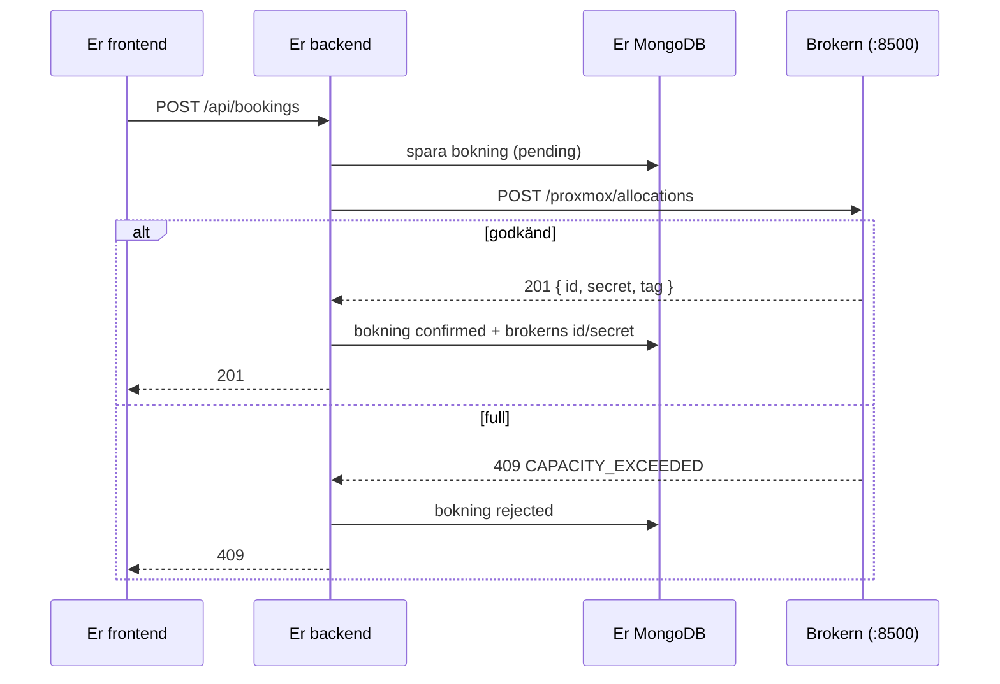

**Gäller bara er som valt resource-booking.** Texteditor-grupper kan hoppa över den här sidan.

Brokern är **en förutsättning för projektet**, inte ett krav, och den ingår inte i [Baseline](/projektet/baseline/). Er backend **ska** använda den för resurser och bokningar.

## Vad är brokern?

Kursen har tre isolerade testsystem: **Proxmox** (virtuella maskiner), **MAAS** (fysiska maskiner) och **OpenStack** (molnkvot). Ni får inte tillgång till deras API:er eller webbgränssnitt. I stället pratar ni med en **broker**, en mellanhand som kör på servern `dv1677-anton`, och som

- visar vad som finns och hur mycket som är ledigt,
- tar emot bokningar och **godkänner eller nekar** dem utifrån verklig kapacitet,
- ser till att alla grupper delar på samma infrastruktur utan att dubbelboka.

Poängen är att *er databas inte är sanningen.* Den lagrar vad som *ska* gälla, medan systemet bakom vet vad som *är* sant. Det är ett riktigt integrationsproblem.



**Frontenden pratar aldrig med brokern.** Bara er backend gör det, med en hemlig token.

## Vad en bokning betyder

Brokern för en bokföring över vem som har reserverat vad och när. **Ni får ingen riktig maskin** som ni loggar in på. Det som sker i era bokningar är att brokern godkänner eller nekar ett tidsfönster. Det är precis det som er bokningslogik ska hantera.

| Typ | Vad en resurs är | Hur ni bokar | Vad som händer |
|-----|------------------|--------------|----------------|
| **Proxmox** | En nod med kapacitet (vCPU, RAM, disk). **Delbar** — flera bokningar rymms samtidigt så länge summan ryms | `want: { vcpus, ramMb, diskGb }` | Brokern reserverar kapaciteten. Ingen VM skapas åt er |
| **MAAS** | En hel maskin. **Odelbar** — en bokning åt gången | `systemId` | Brokern markerar maskinen som er när tidsfönstret börjar |
| **OpenStack** | Ett projekts kvot (vCPU, RAM). En enda delbar "resurs", utan disk | `want: { vcpus, ramMb }` | Brokern reserverar kvoten. Går inte att ta i anspråk på riktigt |

### Vilka resurser ska ni boka?

**Samtliga** — Proxmox, MAAS och OpenStack ska kunna bokas i er app. Men resurserna är **få och delas av alla grupper** (MAAS har fem maskiner, Proxmox och OpenStack en nod respektive ett projekt). Därför:

- **Låt inte bokningar ligga för länge.** Boka kort, och avboka era testbokningar direkt. Annars står andra grupper utan.
- En bokning kan nekas (`ALREADY_BOOKED`, `CAPACITY_EXCEEDED`) för att en annan grupp har resursen, inte för att er egen logik är fel.

Typerna skiljer sig åt: MAAS-maskiner är **odelbara** (bokad eller ledig). Proxmox och OpenStack är **delbara**, där bara summan av kraven avgör och där brokern fattar beslutet.

Det är samma tänk som i bokningslogiken: en konferenssal är *bokad eller ledig*, medan en nod med 16 vCPU rymmer fyra bokningar à 4 och nekar den femte. Skillnaden är bara att *brokern* nu fattar beslutet.

## Kom igång

1. **Token.** Varje grupp får en egen token som läraren lämnar ut privat. Den är hemlig och behandlas som `MONGODB_URI`: bara som secret, aldrig i repot, aldrig i frontenden och aldrig i en skärmdump.
2. **Adress.** Brokern nås på `http://194.47.155.214:8500` — från er VPS (och från skolans nät).
3. **Backend.** Anropen görs från er backend. Brokern har ingen CORS, så en frontend på GitHub Pages kan inte anropa den, och token får inte ligga i frontenden.

Lägg till i `.env.example`, i deploy-workflowet och i `docker-compose.yml`:

| Variabel | Vad |
|----------|-----|
| `BROKER_API_URL` | Brokerns adress, utan avslutande `/` |
| `BROKER_GROUP_TOKEN` | Er grupps token (GitHub-secret). **Aldrig `VITE_`-prefix** |

## API-referens

Allt pratar JSON. Varje anrop kräver headern `X-Booker-Group: <token>`.

Byt `$URL` och `$TOKEN` i exemplen. Kör dem från er VPS eller från en terminal i skolans nät.

```bash
export URL=http://194.47.155.214:8500
export TOKEN=<er token>            # skriv aldrig in den i en fil som committas
```

### `GET /whoami` — vem är vi?

Bekräftar att token fungerar, och ger er tagg.

```bash
curl -s -H "X-Booker-Group: $TOKEN" $URL/whoami
# → { "label": "grupp-5", "tag": "g05" }
```

Om det här fungerar vet ni att nät, token och adress är rätt.

### `GET /<provider>/inventory` — vad finns?

`<provider>` är `proxmox`, `maas` eller `openstack`. Visar verkligt läge, i realtid.

```bash
curl -s -H "X-Booker-Group: $TOKEN" $URL/proxmox/inventory
```

**Proxmox** — en post per nod. `used` är verklig användning just nu:

```json
{ "nodes": [{
  "id": "dv1677-fakeprox", "name": "dv1677-fakeprox",
  "capacity": { "vcpus": 16, "ramMb": 65536, "diskGb": 500 },
  "used": { "vcpus": 4, "ramMb": 8192, "diskGb": 80 },
  "vms": [ … ]
}] }
```

**MAAS** — en post per maskin. `owner` är `null` om ingen har bokat den:

```json
{ "machines": [{ "id": "xk6y7d", "name": "node-3",
  "capacity": { "vcpus": 8, "ramMb": 16384 }, "owner": "bob", "source": "booker" }] }
```

**OpenStack** har en annan form — ett projekts kvot, inte enskilda maskiner:

```json
{ "projects": [{ "id": "…", "name": "…", "capacity": { "vcpus": 20, "ramMb": 51200 },
  "used": { "vcpus": 0, "ramMb": 0 }, "servers": [ … ] }] }
```

⚠️ `used` för OpenStack visar alltid 0, en känd begränsning. Kontrollera själva formen med `curl` innan ni skriver koden.

Fältet `owner` är det `user` som någon bokade med. Skicka därför aldrig e-postadresser som `user` (se `POST /<provider>/allocations` nedan).

### `GET /proxmox/capacity` — hur stort är systemet?

Bara Proxmox (och OpenStack). Systemets *totala* kapacitet, utan bokningar avräknade — till för att planera framåt.

```bash
curl -s -H "X-Booker-Group: $TOKEN" $URL/proxmox/capacity
# → { "vcpus": 16, "ramMb": 32090.66, "diskGb": 125.79 }
```

För MAAS finns inget sådant (en maskin är odelbar) och `GET /maas/capacity` svarar alltid `404 NOT_APPLICABLE`. Använd `/maas/availability`.

Svaret har `ETag`. Skicka `If-None-Match: "<etag>"` så får ni `304 Not Modified` så länge inget ändrats. Det kostar ingenting att fråga ofta.

### `GET /<provider>/availability` — vad är ledigt just nu?

```bash
curl -s -H "X-Booker-Group: $TOKEN" $URL/proxmox/availability
# → { "vcpus": 14, "ramMb": 27994.66, "diskGb": 105.79 }

curl -s -H "X-Booker-Group: $TOKEN" $URL/maas/availability
# → { "machines": [{ "id": "xk6y7d", "name": "simple-buck", "capacity": { "vcpus": 2, "ramMb": 2048 } }] }
```

Det är läget **just nu**, inte för framtida tider. Det är en förhandsvisning, inte ett löfte: `POST` kan fortfarande nekas direkt efteråt.

### `POST /<provider>/allocations` — boka

Samma header som övriga anrop. Det som skickas skiljer sig per typ.

```bash
# Proxmox: ange vad ni behöver, inte en specifik maskin
curl -s -X POST -H "X-Booker-Group: $TOKEN" -H "Content-Type: application/json" \
  -d '{"want":{"vcpus":1,"ramMb":1024,"diskGb":10},"user":"u123","endsAt":"2026-10-20T18:00:00Z"}' \
  $URL/proxmox/allocations

# MAAS: peka ut maskinen (den är odelbar)
curl -s -X POST -H "X-Booker-Group: $TOKEN" -H "Content-Type: application/json" \
  -d '{"systemId":"xk6y7d","user":"u123","endsAt":"2026-10-20T18:00:00Z"}' \
  $URL/maas/allocations

# OpenStack: som Proxmox, men utan diskGb
curl -s -X POST -H "X-Booker-Group: $TOKEN" -H "Content-Type: application/json" \
  -d '{"want":{"vcpus":1,"ramMb":1024},"user":"u123","endsAt":"2026-10-20T18:00:00Z"}' \
  $URL/openstack/allocations
```

| Fält | Krav | Förklaring |
|------|------|------------|
| `endsAt` | ja | ISO 8601 |
| `startsAt` | nej | Standard: nu |
| `user` | ja | Fri text som identifierar vem som bokar. Använd ert interna användar-id, **inte e-post** |
| `want` | Proxmox, OpenStack | Alla fält som positiva tal. OpenStack bara `vcpus` och `ramMb` |
| `systemId` | MAAS | Maskinens `id` från `/maas/inventory` |
| `idempotencyKey` | nej, rekommenderas | Samma nyckel en gång till ger tillbaka er ursprungliga bokning (`200`, inte `201`) i stället för en andra. Använd ert bokning-`_id` |

Svar vid lyckad bokning (`201`):

```json
{ "allocation": { "id": "…", "secret": "…", "tag": "g05-xxxx", "startsAt": "…", "endsAt": "…", "status": "…" } }
```

⚠️ `id` och `secret` visas **bara här**, se [nedan](#id-och-secret).

**Nekas ni** får ni `409`:

- **MAAS:** `ALREADY_BOOKED` — någon annan bokning har ett *överlappande* tidsfönster på samma maskin. Bokningar i olika tidsfönster på samma maskin är helt okej.
- **Proxmox/OpenStack:** `CAPACITY_EXCEEDED` — era `want` ryms inte i det som är kvar. Här finns ingen `ALREADY_BOOKED`: ni får ha flera, till och med helt överlappande, bokningar så länge summan ryms.

### `GET /<provider>/allocations` — era bokningar

Listar er grupps egna aktiva bokningar, även framtida. Visar `tag`, `startsAt`, `endsAt`, `resourceType`, `request`/`machine` och `status`, men **aldrig `id` eller `secret`**.

```bash
curl -s -H "X-Booker-Group: $TOKEN" $URL/proxmox/allocations
```

### `POST /<provider>/allocations/:id/extend` — ändra sluttid

Kräver bokningens egen secret i en separat header:

```bash
curl -s -X POST -H "X-Booker-Group: $TOKEN" -H "X-Booker-Allocation-Secret: $SECRET" \
  -H "Content-Type: application/json" -d '{"endsAt":"2026-10-20T19:00:00Z"}' \
  $URL/proxmox/allocations/$ID/extend
```

Kortar ni tiden (tidigare `endsAt`) går det alltid direkt. **Förlänger** ni görs samma kontroll som vid en ny bokning, så den kan nekas.

### `POST /<provider>/allocations/:id/withdraw` — avboka

```bash
curl -s -X POST -H "X-Booker-Group: $TOKEN" -H "X-Booker-Allocation-Secret: $SECRET" \
  $URL/proxmox/allocations/$ID/withdraw
```

Ingen body behövs. Anropet är **idempotent**: gör ni det igen med samma id och secret får ni `200` med bokningens nuvarande läge (`released`). Det är säkert att försöka igen efter en timeout.

### Felkoder

Brokern svarar `{ "error": "...", "code": "..." }`.

| Kod | Status | Betyder | Vad ni gör |
|-----|--------|---------|------------|
| `GROUP_HEADER_MISSING` | 401 | Ingen `X-Booker-Group` | Bugg hos er. Kontrollera `BROKER_GROUP_TOKEN` |
| `GROUP_REJECTED` | 403 | Okänd eller spärrad token | Be läraren kontrollera/byta token |
| `USER_MISSING` | 400 | `user` saknas vid bokning | Skicka `user` |
| `TIME_WINDOW_MISSING` | 400 | `endsAt` saknas | Skicka `endsAt` |
| `BAD_REQUEST` | 400 | Felaktig body, eller `want`/`systemId` saknas/ogiltigt | Kontrollera body |
| `NO_SUCH_MACHINE` | 404 | MAAS: okänt `systemId` | Er resurslista är inaktuell → synka igen |
| `ALREADY_BOOKED` | 409 | MAAS: maskinen är bokad i fönstret | Visa för användaren. Inte ett fel i koden |
| `CAPACITY_EXCEEDED` | 409 | Proxmox/OpenStack: ryms inte i fönstret | Visa för användaren. Inte ett fel i koden |
| `ALLOCATION_SECRET_MISSING` | 401 | Ingen `X-Booker-Allocation-Secret` | Skicka secret |
| `ALLOCATION_REJECTED` | 403 | Okänd bokning, fel secret, eller inte er grupps | Ni har tappat eller skrivit över secret |
| `NOT_APPLICABLE` | 404 | `GET /maas/capacity` | Använd `/maas/availability` |
| `BACKEND_UNAVAILABLE` | 502 | Brokern kunde inte läsa live-läget | Försök igen senare |

Egna koder i er klient: `UNREACHABLE` (ingen kontakt) och `NOT_CONFIGURED` (saknad konfiguration) — svara med `503` till användaren.

## id och secret

Varje bokning får två värden:

- **`id`** är bokningens identitet, som ett ordernummer.
- **`secret`** är bokningens eget lösenord. Det krävs för att **förlänga** och **avboka** just den bokningen.

De är skilda från er grupps token. Token säger att *ni* är ni. Secret säger att det är *ni som äger just den här bokningen*. Därför kan inte en annan grupp avboka er, även om den känner till `id`.

**Båda visas bara i svaret på själva bokningen.** Tappar ni dem går bokningen inte att avboka eller förlänga, och den blir kvar tills tiden löpt ut. Därför gäller:

1. Spara `id` och `secret` **i er egen databas** direkt när ni får dem.
2. Lämna **aldrig ut `secret`** i era API-svar till frontenden.

## Vad ändras i er databas?

Troligen en del. Referensappens `resources`-samling (`name`, `type`, `description`, `active`) är skriven för resurser ni skapar för hand. När resurserna ligger hos brokern behöver ni **bestämma var sanningen bor.**

### Resurser: två vägar

| | A. Hämta live varje gång | B. Synka till egen samling |
|-|--------------------------|----------------------------|
| Hur | `GET /<provider>/inventory` vid varje förfrågan | Ett skript eller en cron kopierar inventory till `resources` |
| Fördel | Alltid aktuellt, ingen egen resurslista | Snabbt, fungerar när brokern ligger nere, enkelt att koppla bokningar till `resourceId` |
| Nackdel | Långsamt och sårbart: brokern nere = ingen lista | Kan bli inaktuellt |
| Passar | Om ni bara vill visa fakta | **De flesta grupper.** Välj B och förklara hur ni hanterar inaktuell data |

### Fält att lägga till

| Collection | Nytt fält | Syfte |
|------------|-----------|-------|
| `resources` | `provider` (`'proxmox'\|'maas'\|'openstack'`), `externalId` (id hos brokern), `capacity` (`{ vcpus, ramMb, diskGb }`), `source: 'broker'`, `syncedAt` | Koppla er resurs till den verkliga |
| `bookings` | `want` (`{ vcpus, ramMb, diskGb }`) för delbara resurser | Vad bokningen kräver |
| `bookings` | `broker` (`{ allocationId, secret, tag }`) | Utan dem går bokningen inte att avboka eller förlänga |
| `bookings` | `status` får de nya värdena `'pending'` och `'rejected'` | En bokning ni sparat men som brokern ännu inte godkänt, respektive nekat |

Tre saker att tänka på:

1. **`secret` är en hemlighet.** Lämna aldrig ut den i era API-svar. Använd projektion (`{ projection: { 'broker.secret': 0 } }`) när ni listar bokningar.
2. **Er egen overlap-logik:** för MAAS (odelbart) kan ni behålla den som förkontroll. För Proxmox och OpenStack (delbara) ska den **inte** neka på ren överlappning, eftersom bara summan av kraven avgör. Där är brokern auktoriteten.
3. **`user`:** skicka ert interna användar-id, inte e-postadress. Fältet syns för andra i `inventory`.

## Kodexempel

Utgå från dessa, men förstå vad de gör: ni ska kunna förklara varje rad. Exemplen är skrivna för referensappens struktur (`controllers/`, `domain/`, `config/`) och använder Nodes inbyggda `fetch`.

### 1. Brokerklient (`config/broker.js`)

Allt som pratar med brokern ligger på ett ställe. Det gör den lätt att mocka i tester.

```js
const BASE = process.env.BROKER_API_URL
const TOKEN = process.env.BROKER_GROUP_TOKEN
const TIMEOUT_MS = 5000

export class BrokerError extends Error {
  constructor(status, code, message) {
    super(message)
    this.status = status      // HTTP-status från brokern (0 = ingen kontakt)
    this.code = code          // t.ex. 'CAPACITY_EXCEEDED'
  }
}

async function call(path, { method = 'GET', body, secret } = {}) {
  if (!BASE || !TOKEN) {
    throw new BrokerError(0, 'NOT_CONFIGURED', 'BROKER_API_URL/BROKER_GROUP_TOKEN saknas')
  }

  let res
  try {
    res = await fetch(`${BASE}${path}`, {
      method,
      headers: {
        'X-Booker-Group': TOKEN,
        'Content-Type': 'application/json',
        ...(secret ? { 'X-Booker-Allocation-Secret': secret } : {}),
      },
      body: body ? JSON.stringify(body) : undefined,
      signal: AbortSignal.timeout(TIMEOUT_MS),   // utan timeout hänger er request när brokern ligger nere
    })
  } catch (err) {
    throw new BrokerError(0, 'UNREACHABLE', err.message)
  }

  const data = await res.json().catch(() => ({}))
  if (!res.ok) {
    throw new BrokerError(res.status, data.code ?? 'UNKNOWN', data.error ?? res.statusText)
  }
  return data
}

export const broker = {
  whoami: () => call('/whoami'),
  inventory: (provider) => call(`/${provider}/inventory`),
  availability: (provider) => call(`/${provider}/availability`),
  allocate: (provider, payload) => call(`/${provider}/allocations`, { method: 'POST', body: payload }),
  extend: (provider, id, secret, endsAt) =>
    call(`/${provider}/allocations/${id}/extend`, { method: 'POST', body: { endsAt }, secret }),
  withdraw: (provider, id, secret) =>
    call(`/${provider}/allocations/${id}/withdraw`, { method: 'POST', secret }),
}
```

### 2. Hämta resurser (alternativ B — synka till egen samling)

Brokern svarar olika för olika typer: Proxmox ger `{ nodes: [...] }`, MAAS ger `{ machines: [...] }` och OpenStack ger `{ projects: [...] }`.

```js
import { getDB } from '../config/db.js'
import { broker } from '../config/broker.js'

export async function syncResources() {
  const db = getDB()
  const now = new Date()
  const found = []

  const prox = await broker.inventory('proxmox')
  for (const n of prox.nodes ?? []) {
    found.push({
      provider: 'proxmox', externalId: n.id, name: n.name,
      description: `${n.capacity.vcpus} vCPU, ${Math.round(n.capacity.ramMb / 1024)} GB RAM`,
      capacity: n.capacity,
    })
  }

  const maas = await broker.inventory('maas')
  for (const m of maas.machines ?? []) {
    found.push({
      provider: 'maas', externalId: m.id, name: m.name,
      description: `${m.capacity.vcpus} vCPU, ${Math.round(m.capacity.ramMb / 1024)} GB RAM`,
      capacity: m.capacity,
    })
  }

  const os = await broker.inventory('openstack')
  for (const p of os.projects ?? []) {
    found.push({
      provider: 'openstack', externalId: p.id, name: `OpenStack ${p.name.slice(0, 8)}`,
      description: `${p.capacity.vcpus} vCPU, ${Math.round(p.capacity.ramMb / 1024)} GB RAM (kvot)`,
      capacity: p.capacity,
    })
  }

  for (const r of found) {
    await db.collection('resources').updateOne(
      { provider: r.provider, externalId: r.externalId },
      { $set: { ...r, source: 'broker', active: true, syncedAt: now },
        $setOnInsert: { createdAt: now } },
      { upsert: true },
    )
  }

  // Resurser som brokern inte längre känner till: markera, radera inte
  // (era gamla bokningar pekar på dem).
  await db.collection('resources').updateMany(
    { source: 'broker', syncedAt: { $lt: now } },
    { $set: { active: false } },
  )
  return found.length
}
```

Kör `syncResources` vid uppstart och sedan på ett intervall, eller via en admin-route. Notera att ni *inte raderar* resurser som försvunnit, utan markerar dem inaktiva.

### 3. Skapa en bokning

Ordningen är viktig: spara först, fråga sedan brokern, uppdatera till sist. Då har ni ett `_id` att använda som `idempotencyKey`, och en retry efter en timeout skapar inte en dubbelbokning.

```js
import { ObjectId } from 'mongodb'
import { getDB } from '../config/db.js'
import { broker, BrokerError } from '../config/broker.js'
import { findConflicts } from '../domain/overlap.js'

export async function createBooking(req, res) {
  const { resourceId, startsAt, endsAt, want } = req.body
  const db = getDB()

  const resource = await db.collection('resources').findOne({ _id: new ObjectId(resourceId) })
  if (!resource) return res.status(404).json({ error: 'Resource not found' })

  const start = new Date(startsAt), end = new Date(endsAt)
  if (isNaN(start) || isNaN(end) || start >= end) {
    return res.status(400).json({ error: 'Invalid time range' })
  }

  // Odelbart (MAAS): behåll er egen overlap-kontroll som förkontroll.
  // Delbart (Proxmox/OpenStack): hoppa över den — brokern räknar summan av kraven.
  if (resource.provider === 'maas') {
    const conflicts = await findConflicts(resourceId, start, end)
    if (conflicts.length > 0) return res.status(409).json({ error: 'Time slot already booked' })
  }

  const { insertedId } = await db.collection('bookings').insertOne({
    resourceId: resource._id, bookedBy: req.user._id,
    startsAt: start, endsAt: end, want: want ?? null,
    status: 'pending', createdAt: new Date(),
  })

  const payload = resource.provider === 'maas'
    ? { systemId: resource.externalId, user: String(req.user._id), startsAt, endsAt, idempotencyKey: String(insertedId) }
    : { want, user: String(req.user._id), startsAt, endsAt, idempotencyKey: String(insertedId) }

  try {
    const { allocation } = await broker.allocate(resource.provider, payload)
    await db.collection('bookings').updateOne({ _id: insertedId }, {
      $set: {
        status: 'confirmed',
        broker: { allocationId: allocation.id, secret: allocation.secret, tag: allocation.tag },
      },
    })
    const booking = await db.collection('bookings').findOne(
      { _id: insertedId }, { projection: { 'broker.secret': 0 } },   // lämna aldrig ut secret
    )
    return res.status(201).json(booking)
  } catch (err) {
    if (!(err instanceof BrokerError)) throw err
    // 409 = brokern nekade (fullt / redan bokat). Andra fel = vi vet inte.
    const denied = err.status === 409
    await db.collection('bookings').updateOne({ _id: insertedId }, {
      $set: { status: denied ? 'rejected' : 'pending', brokerError: err.code },
    })
    if (denied) return res.status(409).json({ error: 'Not enough capacity', code: err.code })
    return res.status(503).json({ error: 'Booking service unavailable', code: err.code })
  }
}
```

Fundera på vad som händer med en `pending`-bokning när brokern ligger nere.

### 4. Avboka

```js
export async function cancelBooking(req, res) {
  const db = getDB()
  const booking = await db.collection('bookings').findOne({ _id: new ObjectId(req.params.id) })
  if (!booking) return res.status(404).json({ error: 'Not found' })
  // (kontrollera behörighet precis som i era övriga routes)

  const resource = await db.collection('resources').findOne({ _id: booking.resourceId })

  if (booking.broker?.secret) {
    try {
      await broker.withdraw(resource.provider, booking.broker.allocationId, booking.broker.secret)
    } catch (err) {
      if (!(err instanceof BrokerError)) throw err
      return res.status(503).json({ error: 'Could not cancel at provider', code: err.code })
    }
  }

  await db.collection('bookings').updateOne({ _id: booking._id }, { $set: { status: 'cancelled' } })
  res.json({ message: 'Booking cancelled' })
}
```

### 5. Testa utan att anropa brokern på riktigt

Tester ska aldrig träffa den delade brokern. Mocka klienten:

```js
import { vi, test, expect } from 'vitest'
import { broker, BrokerError } from '../config/broker.js'

test('en nekad bokning sparas som rejected', async () => {
  vi.spyOn(broker, 'allocate').mockRejectedValue(
    new BrokerError(409, 'CAPACITY_EXCEEDED', 'full'),
  )
  // ... skicka POST /api/bookings med supertest och kontrollera:
  //   statusen blir 409, och bokningen i databasen har status 'rejected'
})

test('brokern nere ger 503 och en pending bokning', async () => {
  vi.spyOn(broker, 'allocate').mockRejectedValue(new BrokerError(0, 'UNREACHABLE', 'timeout'))
  // ... förvänta 503 och status 'pending'
})
```

## Regler när ni använder brokern

- **Kapaciteten delas av alla grupper.** Boka litet (1 vCPU, ~1 GB) och kort (högst en timme), och **avboka era testbokningar** direkt. Bokar ni upp noden får andra grupper `409`.
- Boka aldrig MAAS-maskiner "för säkerhets skull".
- Token i secrets, aldrig i repot, aldrig i frontenden, aldrig i en skärmdump. Läcker ni den: be läraren spärra och ge en ny.
- Brokern är en kursresurs och kan vara nere. Er app ska klara det.

## Dokumentera i README

Skriv i backendens README: hur ni använder brokern (vilka providers), var `BROKER_API_URL` och `BROKER_GROUP_TOKEN` sätts, och hur ni hanterar att brokern är nere.

## Vanliga fallgropar

| Problem | Orsak |
|---------|-------|
| `fetch failed` / timeout | Fel `BROKER_API_URL`, eller ni kör utanför rätt nät |
| `401 GROUP_HEADER_MISSING` | Token inte inläst — kontrollera att den når containern (`docker compose` `env_file`) |
| Frontenden får CORS-fel mot brokern | Ni anropar från frontenden. Gör det från backend |
| Bokningen går inte att avboka | Ni sparade inte `id` och `secret` |
| Dubbla bokningar efter retry | Ingen `idempotencyKey` |
| Alla får `409` | Någon har bokat upp kapaciteten. Avboka testbokningar |
| `secret` syns i ert API-svar | Ni glömde projektionen |
| Resursen finns inte längre | Er synkade lista är inaktuell. Synka om, och markera inaktiva |
